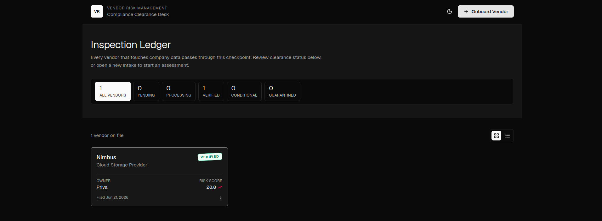
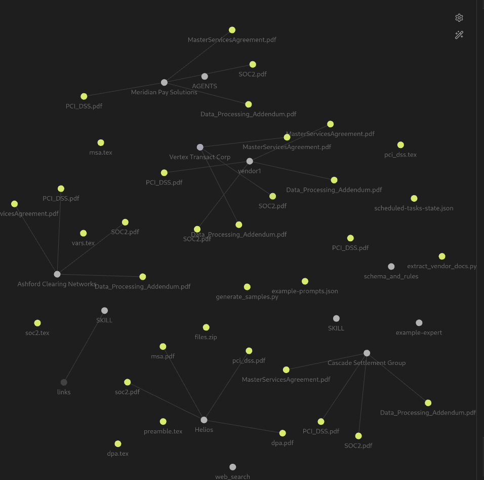
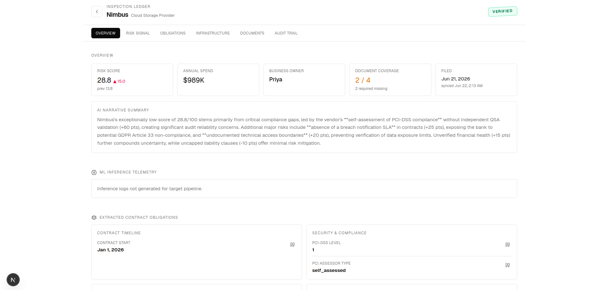
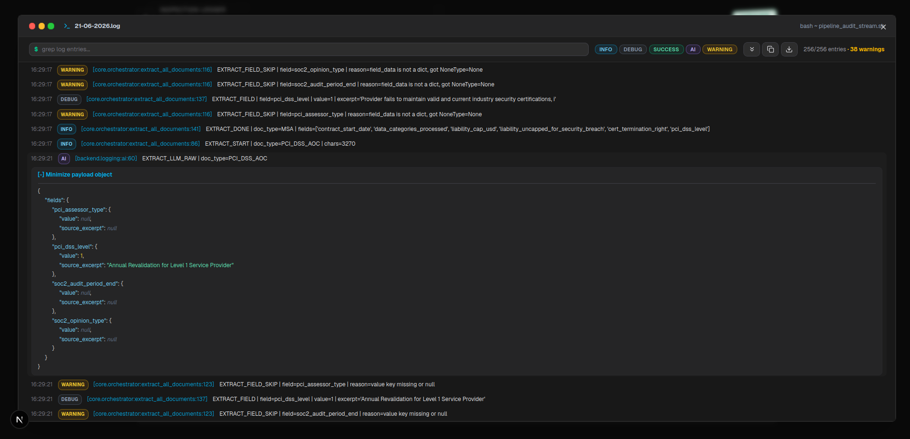
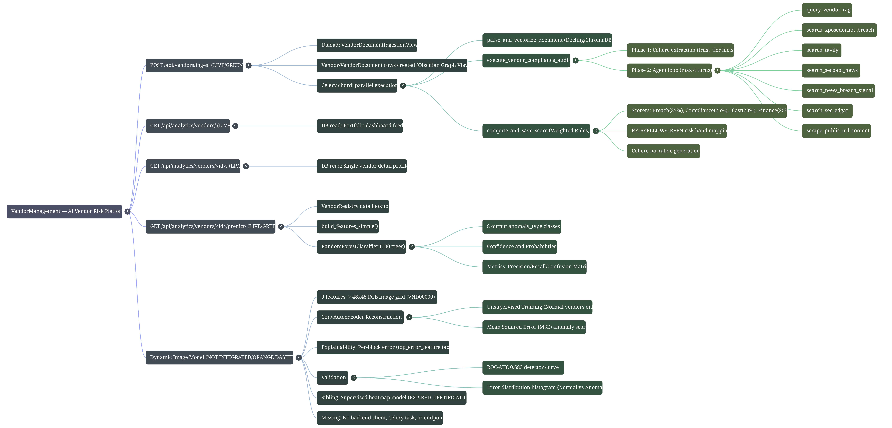
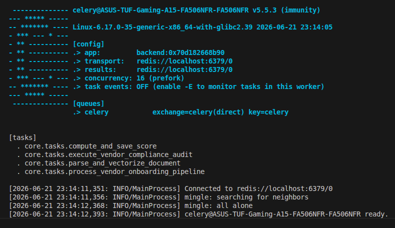
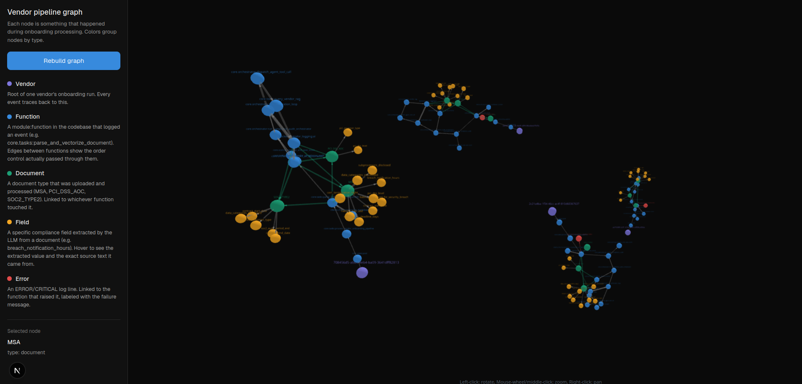
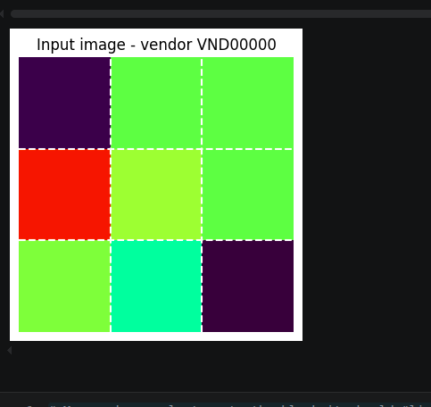
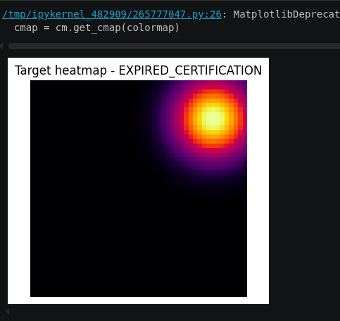

# Multi-Layered Third-Party & Vendor Risk Engine
### 🏆 Societe Generale Hackathon 2026 Submission — Problem Statement 06
**Built with 💻 and ☕ by Sreeharish & Sriram within an intense 48-Hour Pipeline Sprint.**

[](https://python.org)
[](https://www.django-rest-framework.org/)
[](https://docs.celeryq.dev/)
[](https://cohere.com/)
[](https://xgboost.readthedocs.io/)






---

## 🌌 The Grand Vision & Corporate Challenge

In an enterprise environment tracking over 1,000+ modern vendors, security teams move at a glacial pace. Legacy vendor management is structurally broken: tracking critical questions like *"Does our backup vendor possess valid SOC 2 credentials?"* or *"What is our exposure radius on a vendor breach?"* usually results in hunting down static PDFs scattered across local hard drives. 

**Our Project** completely automates third-party risk management. It reads raw compliance documents, orchestrates a bounded multi-agent loop to trace compliance telemetry, executes deterministic, rule-based risk scoring, and layers a dual-engine machine learning pipeline (Supervised XGBoost Classifier + Unsupervised Convolutional Autoencoder Image Transformation) to detect known anomalies and isolate complex, novel security risks.


*Figure 1: Full-scale system topology*

---

## 🛠️ Complete Local Installation & Setup Guide

Ensure your host machine is equipped with **Python 3.12**, **Redis Server**, and access to a **CUDA-compliant GPU** (optimized natively for parallel processing targets like RTX 2050/3050 laptops).

### 1. Clone the Repository & Configure the Environment
```bash
git clone https://github.com/Sri-Ram-A/VendorManagement.git
cd VendorManagement
git checkout hari_pro

# Create and isolate virtual environment
python -m venv venv
source venv/bin/activate  # On Windows use: venv\Scripts\activate

# Install system dependencies
pip install --upgrade pip
pip install -r requirements.txt
```

### 2. Configure Environment Variables

Create a `.env` file in your `backend/backend/` configuration path:

```ini
DEBUG=True
SECRET_KEY=sg_hackathon_risk_secret_token_2026
DATABASE_URL=sqlite:///db.sqlite3
REDIS_URL=redis://127.0.0.1:6379/0
COHERE_API_KEY=your_cohere_production_api_key_here
TAVILY_API_KEY=your_tavily_search_api_key_here
```

### 3. Initialize Databases & Vector Stores

```bash
cd backend
python manage.py migrate
python manage.py shell -c "from django.contrib.auth import get_user_model; get_user_model().objects.create_superuser('admin', 'admin@rvce.edu.in', 'sg_admin_pass')"
```

### 4. Boot Up the Distributed Async Infrastructure

Open three isolated terminal shells inside your environment to drive the concurrent processing matrix:

* **Terminal A (Web Application Server):**
```bash
python manage.py runserver
```


* **Terminal B (Redis Message Broker Backend):**
```bash
redis-server 
# or
podman run redis-container
```


* **Terminal C (Distributed Celery Workers Processing Cluster):**
```bash
celery -A backend worker --loglevel=info
```


---

## 🪵 Chronological Journey: Building in 48 Hours

```
[Data Ingestion] ➔ [Celery Pipelines] ➔ [Agent Loops] ➔ [XGBoost Core] ➔ [Autoencoders]
```

### ⏳ Phase 1: High-Fidelity Data Ingestion & The Compliance Ledger

Real-world enterprise vendor assessment requires actual documentation. To break free from simple string mockups, we assembled data profiles mimicking six realistic organizations:

* *Ashford Clearing Networks*, *Helios*, *Nimbus*, *Cascade Settlement Group*, *Meridian Pay Solution*, and *Vertex Transact Corp*.

Each target infrastructure contains **4 foundational compliance documents**:

1. **Master Services Agreement (MSA):** The binding corporate contract establishing underlying Service Level Agreements (SLAs), operational legal bounds, liabilities, and multi-tenant data governance conditions.
2. **Data Processing Addendum (DPA):** The compliance schema dictating data transfer boundaries, privacy frameworks (GDPR/CCPA guidelines), and specific security guarantees relative to cross-border telemetry.
3. **SOC 2 Type II Report:** The gold-standard security audit analyzing operational controls across Security, Availability, Processing Integrity, Confidentiality, and Privacy over extended monitoring timelines.
4. **PCI-DSS Compliance Certification (AOC):** The strict technical assessment validating data protection and network segment isolation across point-of-sale environments handling payment card architectures.

To parse this structure, we implemented **Docling** inside `clients/docling.py` to compile complex unstructured PDF assets directly into unified, structured Markdown code fragments.

⚠️ *Hackathon Tip:* If like mine -- your machine throws an environment layout error loading RapidOCR components inside Docling, explicitly initialize your local directory layout via:

```bash
mkdir -p ~/.micromamba/envs/pytorch/lib/python3.12/site-packages/rapidocr/models
```

---

### ⚡ Phase 2: Distributed Non-Blocking Pipelines via Celery

Processing hundreds of pages of raw structural compliance text across vector stores causes standard HTTP thread blockages. To maximize local consumer loops on an **RTX 2050 / RTX 3050 laptop setup**, we introduced distributed background processing tasks via Celery.


*Figure 2: Concurrent ingestion pipeline using Celery chords, signatures, and tasks.*

Using complex structural primitives (`.delay()`, `.s()`, `.si()`, and `chord`), we engineered a non-blocking map-reduce processing sequence:

* **Step A:** Instantiate the Django model tracking `Vendor` and `Document` data properties.
* **Step B:** Execute parallel background extractions. Read document byte streams, chunk text streams dynamically, and inject vectors concurrently into a localized instance of **ChromaDB**.
* **Step C:** Gather parallel task return tokens via a consolidated Celery `chord`, triggering the final multi-agent evaluation sequence immediately upon complete ingestion.

---

### 🧠 Phase 3: The Bounded Multi-Agent Orchestrator & Trust Hierarchy

Once compliance vectors are locked into ChromaDB, the **LLM Agent Orchestrator** inside `core/orchestrator.py` takes charge. Driven by Cohere’s `command-r-plus-08-2024` (and defaulting to `command-a-reasoning-08-2025` for enhanced inference tasks), the agent queries tools to synthesize data:

```python
# Model orchestration selection logic
model = "command-r-plus-08-2024" if force_json else "command-a-reasoning-08-2025"
```

The system binds the agent's reasoning loop to a precise set of specialized tools (`TOOL_REGISTRY`):

* `query_vendor_rag()`: Scans internal vector structures across uploaded compliance contracts.
* `search_sec_edgar()`: Extracts authoritative financial disclosures and regulatory findings.
* `search_tavily()`: Grapes open-source telemetry for public news and emerging threat logs.

🛡️ **Structural Guardrails Built-In:**

* **Bounded Multi-Turn Iteration:** To prevent runaway loops and infinite token bleed, the agent is bounded at `MAX_AGENT_STEPS = 4`.
* **Deterministic Trust Hierarchy:** To handle contradicting claims (e.g., a news article claiming a vendor is certified vs an expired audit document), we coded a strict **Trust Tier Scoreboard**:

$$\text{SOC2/DPA Audits (Tier 1)} \gg \text{Contract Text (Tier 2)} \gg \text{SEC Filings (Tier 3)} \gg \text{OSINT Threat Intel (Tier 4)}$$


Higher-tier verifiable facts automatically overwrite and replace lower-trust findings.

---

### 🧮 Phase 4: Deterministic Risk Scoring & Interactive Graph Trace

A major flaw in modern AI apps is letting an LLM arbitrarily hallucinate a risk score out of thin air. In `core/scoring.py`, **we stripped the LLM of any mathematical scoring authority**.

Risk calculation is handled by an auditable, rule-based scoring engine using strict operational weights:

* **Breach Intelligence Weight:** 35%
* **Compliance Maturity Weight:** 25%
* **Data Blast Radius Weight:** 20%
* **Financial Stability Weight:** 20%

```
Risk Score = Data Access Score (0-40) + Cert Gaps (0-30) + Breach History (0-20) + Financial Risk (0-10)
```

The LLM is relegated to translating the raw rule trace results into a grounding, readable executive summary. Concurrently, every single step, token, tool call, and state transition is captured by our internal logging engine. Using `logs_to_graph.py`, these logs are compiled into a unified `{nodes, links}` network structure, driving an interactive 3D graph visualization that traces system execution paths in real-time.


*Figure 3: Interactive execution graph mapping tool*

---

### 📈 Phase 5: Supervised ML Classification via XGBoost

Midway through the hackathon, the core engineering team released the official evaluation target dataset (`vendor_registry.csv`), tracking over 200+ multi-variant vendor matrices.

We pivoted instantly, engineering a rigorous feature extractor inside `train_xgboost.py` that maps complex textual states into high-impact numeric columns:

1. `audit_to_contract_risk`: Compounds risk by calculating audit age over remaining contract days.
2. `breach_x_scope`: Intercepts extreme conditions where confirmed breaches overlap with full database access.
3. `contract_expired_flag`: Captures structural and legal vulnerabilities from expired contract dates.

We trained an **XGBoost Classifier** on this data using stratified K-fold cross-validation. This supervised engine achieved **~92% prediction accuracy**, grouping incoming profiles into operational categories like `LOW_RISK_VENDOR`, `EXPIRED_CERTIFICATION`, and `VENDOR_UNDER_INVESTIGATION`.

---

### 🎨 Phase 6: The Innovation Leap — Tabular-to-Image Autoencoder

While XGBoost handles known risk signatures with high accuracy, it fails against **unknown anomaly patterns** (Zero-Day risks, novel supply-chain attacks, or unprecedented compliance configurations). To solve this, teammate Sreeharish introduced a cutting-edge **Computer Vision Anomaly Detection Autoencoder** (`image_encode/`).

#### 1. Mapping Multi-Dimensional Matrix Data onto a Semantic Grid

We transformed tabular multi-dimensional telemetry values into a fixed, structured **3x3 semantic image grid**. Every structural feature category occupies an immutable geometric position on a canvas patch:

```
+------------------------+------------------------+------------------------+
|      [Block 0,0]       |      [Block 0,1]       |      [Block 0,2]       |
|   Annual Spend Patch   |    Audit Age Patch     |  Breach Severity Patch |
+------------------------+------------------------+------------------------+
|      [Block 1,0]       |      [Block 1,1]       |      [Block 1,2]       |
| Contract Urgency Patch |    SOC 2 Status Patch  |    PCI Audit Patch     |
+------------------------+------------------------+------------------------+
|      [Block 2,0]       |      [Block 2,1]       |      [Block 2,2]       |
| Data Access Scope Patch|   SLA Severity Patch   |  Composite Risk Patch  |
+------------------------+------------------------+------------------------+
```

Every numerical embedding array is scaled natively into standard pixel byte spaces ($0-255$), producing a continuous **$48 \times 48 \times 3$ master RGB image canvas**.

*Why?* Early attempts using variable pixel layouts failed because Convolutional Neural Networks (CNNs) rely on spatial proximity. By anchoring each feature to an immutable visual coordinate, the CNN can successfully learn spatial correlations and systemic relationships across separate compliance metrics.

<p align="center">
  
  
</p>

<p align="center">
  <b>Figure 4:</b> Visualizing how raw multi-dimensional text configurations are compiled into pixel arrays.
</p>

#### 2. Bottleneck Reconstruction & Explainable Anomalies

We trained a Deep Convolutional Autoencoder **exclusively on healthy, stable, unbreached vendor records**. Through series of downsampling convolutions, the input space ($2304$ raw pixels) is squeezed through an aggressive bottleneck latent space measuring just **$2 \times 2 \times 32$ ($128$ dimensions)** before being upsampled back to the original format.

```
Input Canvas (48x48x3) ➔ Encoders ➔ Latent Space (128 Dimensions) ➔ Decoders ➔ Reconstructed Canvas
```

* **Healthy Profiles:** When a typical, compliant vendor profile passes through the system, the network reconstructs it with near-zero error.
* **Anomalous Profiles:** When an unknown risk pattern arrives (e.g., an unclassified breach condition combined with a stale audit), the autoencoder fails to reconstruct it, throwing a massive **Mean Squared Error (MSE)** spike that acts as an unsupervised anomaly alert.

🔥 **The Ultimate Explainability Hack:**
Unlike standard "black-box" neural networks that only output a vague anomaly score, our engine isolates the exact pixel coordinate where the reconstruction failed. By querying the coordinate error against our fixed 3x3 layout, the system can output explicit descriptions, such as:

> `[ANOMALY ALERT]: Systemic anomaly tracked at coordinate block [1,1]. Reconstruction failure isolated to Compliance Certification: SOC 2 Manifold.`

---

*Developed under extreme time constraints during the 2026 Societe Generale Hackathon event. Built to scale, engineered to protect.*
***

